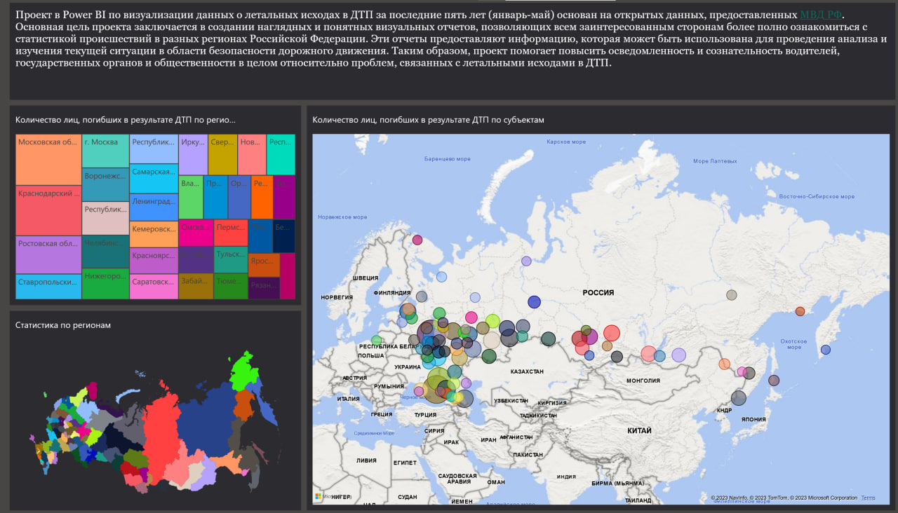
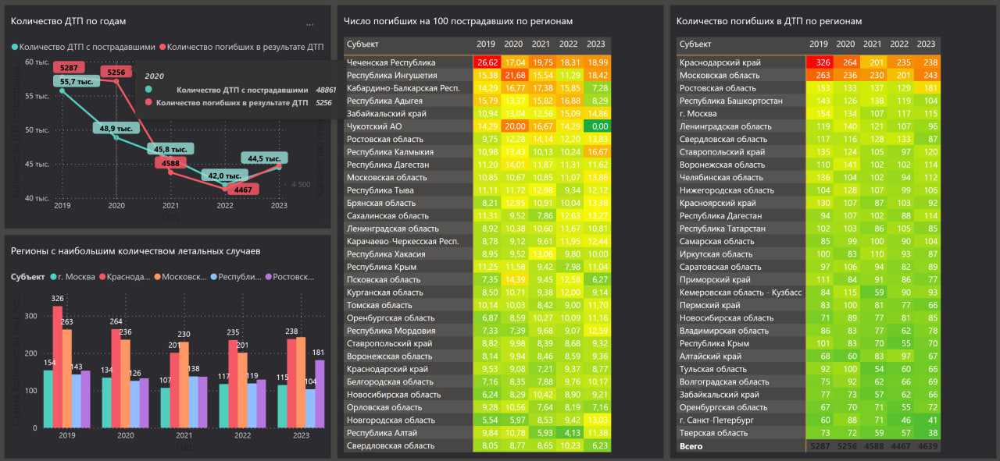
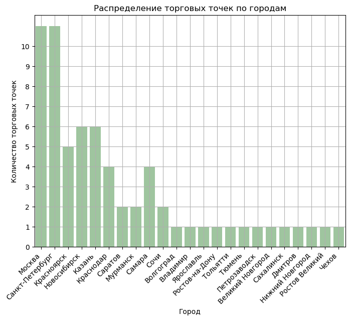
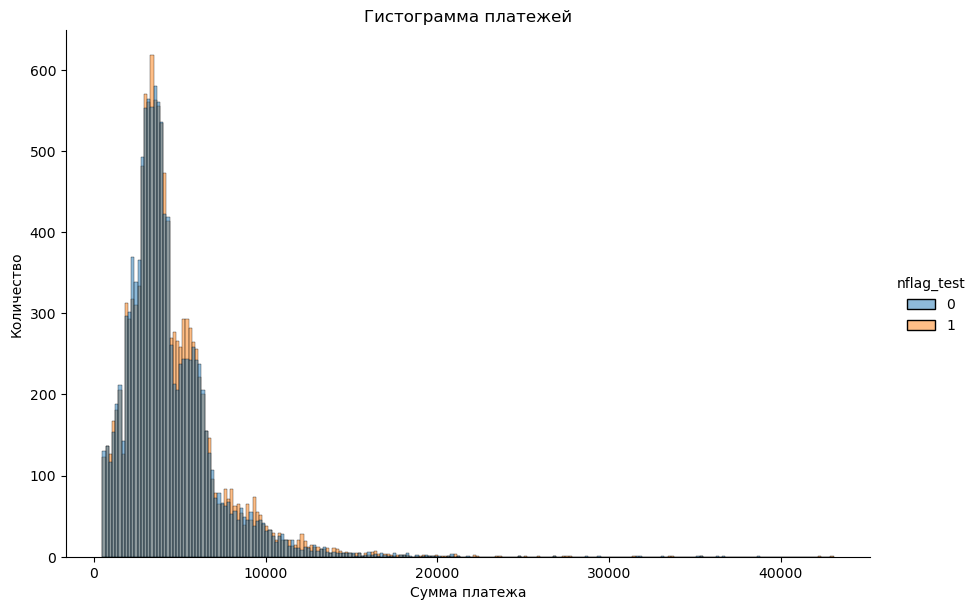

<!-- header -->


<!-- текст -->
<h2 align="center">Я аналитик данных. В этом репозитории вы можете найти некоторые из моих проектов, выполненных во время обучения и практики.  Мои проекты включают в себя анализ данных о клиентах и выявление интересных трендов и паттернов. Я также работал над проектами, связанными с обработкой и визуализацией больших объемов данных. В будущем я стремлюсь расширить свои знания и навыки в области аналитики данных, чтобы стать опытным профессионалом в этой сфере.</h2>

<!-- Инструменты  -->
<h3 align="center">Используемые инструменты</h3>
<p align="center">
<a href="https://www.microsoft.com/en-us/microsoft-365/excel" target="blank"></a>
<a href="https://sheets.google.com/" target="blank"></a>
<a href="https://www.postgresql.org/" target="blank"></a>
<a href="https://www.mysql.com/" target="blank"></a>
<a href="https://www.microsoft.com/en-us/sql-server" target="blank"></a>
<a href="https://www.metabase.com/" target="blank"></a>
<a href="https://powerbi.microsoft.com/en-us/" target="blank"></a>
<br>
<a href="https://jupyter.org/" target="blank"></a>
<a href="https://www.python.org/" target="blank"></a>
<a href="https://pandas.pydata.org/" target="blank"></a>
<a href="https://numpy.org/" target="blank"></a>
</p>


<h2 align="center"></h2>

<!-- Оглавление -->
**Оглавление**

 - [Список представленных проектов](#проекты)
     - [Калькулятор юнит-экономики онлайн-школы](#-калькулятор-юнит-экономики-онлайн-школы-)
     - [Калькулятор юнит-экономики онлайн-кинотеатра](#-калькулятор-юнит-экономики-онлайн-школы-)
     - [Когортный анализ онлайн-кинотеатра](#-когортный-анализ-онлайн-кинотеатра-с-помощью-sql-)
     - [Моделирование изменения балансов студентов онлайн школы](#-моделирование-изменения-балансов-студентов-онлайн-школы-)
     - [Проверка гипотез в онлайн школе](#-проверка-гипотез-в-онлайн-школе-)
     - [Анализ "аэропортовых очередей" в агрегаторе такси](#-анализ-аэропортовых-очередей-в-агрегаторе-такси-)
     - [Визуализация данных о ДТП в РФ с помощью PowerBI](#-визуализация-данных-о-дтп-в-рф-с-помощью-powerbi)
     - [Анализ результатов АБ теста ритейла](#анализ-результатов-аб-теста-ритейла)
- [Контактная информация](#контактная-информация)

<!-- Проекты заголовок -->
<h2 align="center">Проекты:</h2>
<p align="center">
  
<!-- Проект 1 -->

<h3 align="center"> Калькулятор юнит-экономики онлайн-школы </h3>  
<p align="center">Задачи:</p>
<ul>
<li>Ввести поправочные коэффициенты </li>
<li>Сделать динамический перерасчёт студентов </li>
<li>Просчитать сценарий, при котором планы маркетинга увеличатся на заданное значение </li> 
<li>Спрогнозировать количество уроков в связи с перерасчётом </li> 
<li>Составить план найма преподавателей </li>
</ul>
<details>
<summary>Калькулятор</summary>  
<a href="https://github.com/VasilyDataNinja/portfolio/blob/main/projects/project1/p1.xlsx">Excel файс с калькулятором
</a> 
</details>
<p align="center">
<a href="https://github.com/VasilyDataNinja/portfolio/blob/main/projects/project1/p1.1.jpg">
</a>
<a href="https://github.com/VasilyDataNinja/portfolio/blob/main/projects/project1/p1.2.jpg">

</a></p>

<!-- Проект 2 -->
<h3 align="center"> Калькулятор юнит-экономики онлайн-кинотеатра </h3>  
<p align="center">Задачи:</p>
<ul>
<li>Просчитать юнит-экономику продукта </li>
<li>Предложить сценарий по настройке параметров для выхода на 25-ти процентную маржинальность</li>
<li>Исследовать данные о пользователях и их поведении </li>
<li>Собрать визуализации основных бизнес-показателей </li>  
</ul>
<details>
<summary>Калькулятор</summary> 
<a href="https://github.com/VasilyDataNinja/portfolio/blob/main/projects/project2/p2.xlsx">Excel файс с калькулятором
</a>
</details>
<p align="center">
<a href="https://github.com/VasilyDataNinja/portfolio/blob/main/projects/project2/p2.1.jpg">
</a>
<a href="https://github.com/VasilyDataNinja/portfolio/blob/main/projects/project2/p2.2.jpg">

</a></p>
</p>

<!-- Проект 3 -->
<h3 align="center"> Когортный анализ онлайн-кинотеатра с помощью SQL </h3>  
<p align="center">Задачи:</p>
<ul>
<li>Построить распределение количества первых покупок клиента</li>
<li>Построить визуализацию количества покупок в разных срезах</li>
<li>Рассчитать винтажную доходимость по партнёрской программе</li>
</ul>
</p>
<details>
  <summary>Код SQL запроса 1 </summary>
  <pre><code>

  ```sql
 SELECT   is_trial
       , name_partner
       , buy_rank
       , COUNT(*) AS cnt
FROM
   (
      SELECT a.*
             , RANK() OVER (PARTITION BY user_id ORDER BY date_purchase) AS buy_rank
             , name_partner
      FROM skycinema.client_sign_up a 
        JOIN skycinema.partner_dict b 
        ON a.partner = b.id_partner
   ) AS t
GROUP BY is_trial, name_partner, buy_rank
ORDER BY is_trial, name_partner, buy_rank
  ```
</code></pre>
</details>
<details>
  <summary>Код SQL запроса 2 </summary>
  <pre><code>

  ```sql
 SELECT  name_partner
        , COUNT(CASE WHEN buy_rank = 2 THEN 1 END) / COUNT(DISTINCT user_id)::FLOAT AS second_buy
        , COUNT(CASE WHEN buy_rank = 3 THEN 1 END) / COUNT(DISTINCT user_id)::FLOAT AS third_buy
        , COUNT(CASE WHEN buy_rank = 4 THEN 1 END) / COUNT(DISTINCT user_id)::FLOAT AS fourth_buy
        , COUNT(CASE WHEN buy_rank = 5 THEN 1 END) / COUNT(DISTINCT user_id)::FLOAT AS fifth_buy
        , COUNT(CASE WHEN buy_rank = 6 THEN 1 END) / COUNT(DISTINCT user_id)::FLOAT AS sixth_buy
FROM 
   (
      SELECT  a.*
             , RANK() OVER (PARTITION BY user_id ORDER BY date_purchase) AS buy_rank
             , name_partner
      FROM skycinema.client_sign_up a 
        JOIN skycinema.partner_dict b 
        ON a.partner = b.id_partner
   ) AS t1
GROUP BY name_partner
ORDER BY name_partner
  ```
</code></pre>
</details>


<details>
<summary>Аналогичный анализ с помощью Python</summary> 
 
  [Посмотреть файл ноутбука](https://github.com/VasilyDataNinja/portfolio/blob/main/projects/project3/project3.ipynb) 
</details>
<details>
<summary>Результаты запроса</summary>  
<a href="https://github.com/VasilyDataNinja/portfolio/blob/main/projects/project3/p3.xlsx">Excel файс с результатами
</a>
</details>
<p align="center">
<a href="https://github.com/VasilyDataNinja/portfolio/blob/main/projects/project3/p3.1.jpg">
</a>
<a href="https://github.com/VasilyDataNinja/portfolio/blob/main/projects/project3/p3.2.jpg">

</a></p>
</p>

<!-- Проект 4 -->
<h3 align="center"> Моделирование изменения балансов студентов онлайн школы </h3> 
<p align="center">Задачи:</p>
<ul>
<li>Создать таблицу с балансами всех студентов за каждый календарный день </li>
<li>Создать таблицу с изменением балансов под влиянием транзакций и списаний уроков</li>
<li>Создать таблицу с балансами каждого студента за каждый день</li>
<li>Построить визуализацию итоговых результатов</li>
</ul>
</p>
<br>

<details>
  <summary>Код SQL запроса 1 </summary>
  <pre><code>

  ```sql
  with first_payments as 
        (
        select  user_id
                , min(date_trunc('day', transaction_datetime)) as first_payment_date
        from skyeng_db.payments
            where status_name = 'success'
        group by user_id
        )
, all_dates as 
        (
        select generate_series('2016-01-01'::date, '2016-12-31'::date, '1 day'::interval) as dt
        )
, payments_by_dates as 
        (
        select user_id
                , date_trunc('day', transaction_datetime) as payment_date
                , sum(classes) as transaction_balance_change
        from skyeng_db.payments
            where status_name = 'success'
        group by user_id, payment_date
        order by user_id
        )
, all_dates_by_user as
        (
        select *
        
        from first_payments a 
            join all_dates b
            on a.first_payment_date <= b.dt
        )
, classes_by_dates as
        (
        select  user_id
                , date_trunc('day', class_start_datetime) as class_date
                , count(id_class)*-1 as classes
        from skyeng_db.classes
            where class_status in('success','failed_by_student')
            and class_type != 'trial'
        group by user_id, class_date
        )
, payments_by_dates_cumsum as
        (
        select a.user_id
                , dt
                , coalesce(transaction_balance_change,0) as transaction_balance_change
                , sum(coalesce(transaction_balance_change,0)) over (partition by a.user_id order by dt rows between unbounded preceding and current row) as transaction_balance_change_cs
        from all_dates_by_user a
            left join payments_by_dates b
            on a.user_id = b.user_id 
            and a.dt = b.payment_date
        )
, classes_by_dates_dates_cumsum as 
        (
        select a.user_id
                , dt
                , coalesce(classes,0) as classes
                , sum(coalesce(classes,0)) over (partition by a.user_id order by dt rows between unbounded preceding and current row) as classes_cs
        from all_dates_by_user a 
            left join classes_by_dates b
            on a.user_id = b.user_id and a.dt = b.class_date
        )
, balances as
        (
        select a.user_id
                , a.dt
                , transaction_balance_change
                , transaction_balance_change_cs
                , classes
                , classes_cs
                , classes_cs + transaction_balance_change_cs as balance
        from payments_by_dates_cumsum a
            join classes_by_dates_dates_cumsum b
            on a.user_id = b.user_id and a.dt = b.dt
        )
select dt
        , sum(transaction_balance_change) transaction_balance_change
        , sum(transaction_balance_change_cs) transaction_balance_change_cs
        , sum(classes) classes 
        , sum(classes_cs) classes_cs 
        , sum(balance) balances
from balances 
group by dt
order by dt
  ```
</code></pre>

</details>

<details>
  <summary>Код SQL запроса 2 </summary>
  <pre><code>

  ```sql
  with first_payments as 
        (
        select  user_id
                , min(date_trunc('day', transaction_datetime)) as first_payment_date
        from skyeng_db.payments
            where status_name = 'success'
        group by user_id
        )
, all_dates as 
        (
        select generate_series('2016-01-01'::date, '2016-12-31'::date, '1 day'::interval) as dt
        )
, payments_by_dates as 
        (
        select user_id
                , date_trunc('day', transaction_datetime) as payment_date
                , sum(classes) as transaction_balance_change
        from skyeng_db.payments
            where status_name = 'success'
        group by user_id, payment_date
        order by user_id
        )
, all_dates_by_user as
        (
        select *
        
        from first_payments a 
            join all_dates b
            on a.first_payment_date <= b.dt
        )
, classes_by_dates as
        (
        select  user_id
                , date_trunc('day', class_start_datetime) as class_date
                , count(id_class)*-1 as classes
        from skyeng_db.classes
            where class_status in('success','failed_by_student')
            and class_type != 'trial'
        group by user_id, class_date
        )
, payments_by_dates_cumsum as
        (
        select a.user_id
                , dt
                , coalesce(transaction_balance_change,0) as transaction_balance_change
                , sum(coalesce(transaction_balance_change,0)) over (partition by a.user_id order by dt rows between unbounded preceding and current row) as transaction_balance_change_cs
        from all_dates_by_user a
            left join payments_by_dates b
            on a.user_id = b.user_id 
            and a.dt = b.payment_date
        )
, classes_by_dates_dates_cumsum as 
        (
        select a.user_id
                , dt
                , coalesce(classes,0) as classes
                , sum(coalesce(classes,0)) over (partition by a.user_id order by dt rows between unbounded preceding and current row) as classes_cs
        from all_dates_by_user a 
            left join classes_by_dates b
            on a.user_id = b.user_id and a.dt = b.class_date
        )
, balances as
        (
        select a.user_id
                , a.dt
                , transaction_balance_change
                , transaction_balance_change_cs
                , classes
                , classes_cs
                , classes_cs + transaction_balance_change_cs as balance
        from payments_by_dates_cumsum a
            join classes_by_dates_dates_cumsum b
            on a.user_id = b.user_id and a.dt = b.dt
        )
select *
from balances
/*Убрать дни когда баланс студента не менялся*/
-- where (transaction_balance_change != 0 or classes != 0)
/*Если потребуется посмотреть балансы определённого студента*/
-- and user_id = 1953678
order by user_id, dt
limit 366
  ```
</code></pre>
</details>
<details>
<summary>Результаты запроса</summary>  
<a href="https://github.com/VasilyDataNinja/portfolio/blob/main/projects/project4/p4.xlsx">Excel файс с результатами
</a>
</details>
<p align="center">
<a href="https://github.com/VasilyDataNinja/portfolio/blob/main/projects/project4/p4.1.jpg">
</a>
<a href="https://github.com/VasilyDataNinja/portfolio/blob/main/projects/project4/p4.2.jpg">

<a href="https://github.com/VasilyDataNinja/portfolio/blob/main/projects/project4/p4.3.jpg">

</a></p>
</p>

<!-- Проект 5 -->
<h3 align="center"> Проверка гипотез в онлайн школе </h3> 
<p align="center">Гипотезы:</p>
<ul>
<li>Короткие уроки чаще закупаются "оптом"</li>
<li>У учеников-старожилов бóльшую часть занятий ведут продвинутые учителя</li>
<li>Снижение объема поступающих средств в связи со снижением количества проводимых уроков и общего количества учащихся студентов</li>
</ul>
</p>


<details>
  <summary>Код SQL запроса 1 </summary>
  <pre><code>

  ```sql
select case when b.user_id is not null then 1 else 0 end as user_flag
        , avg(class_end_datetime -  class_start_datetime) as avg_duration
from skyeng_db.classes a 
                        left join (
                            select 
                                    user_id 
                            from skyeng_db.payments
                                where status_name = 'success'
                                group by user_id
                                having avg(classes) > 25 and count(*) > 3
                            ) b
                        on a.user_id = b.user_id
    where class_status = 'success'
    and date_trunc('year', class_start_datetime) = '2016-01-01'
    and class_end_datetime - class_start_datetime between interval '20 minute' and interval '3 hour'
    group by user_flag
  ```
</code></pre>
</details>

<details>
  <summary>Код SQL запроса 2 </summary>
  <pre><code>

  ```sql
select  max_teaching_level
        , sum(class_end_datetime - class_start_datetime) as sum_teaching
from skyeng_db.classes a    join skyeng_db.teachers b 
                            on a.id_teacher = b.id_teacher
    where max_teaching_level is not null and user_id in ( 
                                                        select 
                                                            user_id
                                                        from skyeng_db.classes
                                                            where class_status = 'success'
                                                        group by user_id
                                                        having sum(class_end_datetime  - class_start_datetime) > interval '48 hour'
                                                        )
group by max_teaching_level
order by sum_teaching desc
  ```
</code></pre>
</details>

<details>
  <summary>Код SQL запроса 3 </summary>
  <pre><code>

  ```sql
select t1.mm
        , class_cnt
        , user_cnt
        , total_payment
from
(
select date_trunc('month', class_start_datetime) as mm
        , count(case when class_status = 'success' then 1 end) as class_cnt
        , count(user_id) as user_cnt
from skyeng_db.classes
where date_trunc('year', class_start_datetime) = '2017-01-01'
group by mm
) t1
full join

(
select date_trunc('month', transaction_datetime) as mm
        , sum(payment_amount) as total_payment
from skyeng_db.payments
where payment_amount > 0 and date_trunc('year', transaction_datetime) = '2017-01-01'
group by mm
) t2
on t1.mm = t2.mm
  ```
</code></pre>
</details>

<p align="center">
<a href="https://github.com/VasilyDataNinja/portfolio/blob/main/projects/project5/p5.1.jpg">

</a></p>
</p>

<!-- Проект 6 -->
<h3 align="center"> Анализ "аэропортовых очередей" в агрегаторе такси </h3> 
<p align="center">Задачи:</p>
<ul>
<li>Произвести расчёт количества выездов с заказом и без на определённом сегменте водителей</li>
<li>Рассчитать среднее время ожидания заказа и долю успешных поездок</li>
<li>Ко скольки лучше приезжать в Домодедово, чтобы уехать как можно быстрее и с наибольшей вероятностью получить заказ?</li>
</ul>
</p>

<details>
  <summary>Код SQL запроса 1 </summary>
  <pre><code>

  ```sql
select  left_w_order
        , count(*) as left_count
from skytaxi.airport_visit
where id_driver in  (select id_driver from
                        (
                            select *
                                    , rank() over (order by total_wait_time desc) as wait_rank
                            
                            from 
                            (
                            
                                select id_driver
                                        , sum(time_left - time_came) as total_wait_time
                                from skytaxi.airport_visit
                                    where id_driver in  (select id_driver 
                                                        from skytaxi.airport_visit
                                                            group by id_driver 
                                                            having count(*) > 1 
                                                        )
                                group by id_driver
                                order by total_wait_time desc
                            ) t1
                        ) t2
                        where wait_rank <= 10
                    )
group by left_w_order

  ```
</code></pre>
</details>

<details>
  <summary>Код SQL запроса 2 </summary>
  <pre><code>

  ```sql
with port_a as (
                select 
                    id_port
                from skytaxi.airport_visit
                group by id_port
                having count(*) > 100
                ),  
id_driver_a as (
                select id_driver
                from skytaxi.airport_visit
                group by id_driver
                having sum(time_left - time_came) > interval '12 hour'
                )
select  avg(time_left - time_came) as avg_wait_time
        , count(case when left_w_order = 1 then 1 else null end)/count(*)::float as flag_left_w_order
from skytaxi.airport_visit
    where id_driver in (select * from id_driver_a) and id_port in (select * from port_a)

  ```
</code></pre>
</details>

<details>
  <summary>Код SQL запроса 3 </summary>
  <pre><code>

  ```sql

with port_a as (
                select 
                    id_port
                from skytaxi.airport_visit
                group by id_port
                having count(*) > 100
                ),  
id_driver_a as (
                select id_driver
                from skytaxi.airport_visit
                group by id_driver
                having sum(time_left - time_came) > interval '12 hour'
                )
select  avg(time_left - time_came) as avg_wait_time
        , count(case when left_w_order = 1 then 1 else null end)/count(*)::float as flag_left_w_order
from skytaxi.airport_visit
    where id_driver in (select * from id_driver_a) and id_port in (select * from port_a)
  ```
</code></pre>
</details>

<details>
<summary>Результаты запроса</summary>  
<a href="https://github.com/VasilyDataNinja/portfolio/blob/main/projects/project6/p6.xlsx">Excel файс с результатами
</a>
</details>

<p align="center">
<a href="https://github.com/VasilyDataNinja/portfolio/blob/main/projects/project6/6.1.jpg">

</a></p>
</p>

<!-- Проект 7 -->
<h3 align="center"> Визуализация данных о ДТП в РФ с помощью PowerBI</h3> 
<p align="center">Цели:</p>
<ul>
<li>Практика использования инструмента Power BI для визуализации</li>
<li>Практика работы с "незнакомыми датасетами" взятыми из открытого источника</li>
<li>Составить красивый и понятный Dashboard</li>
</ul>
</p>

<details>
<summary>Dashboard</summary>  
<a href="https://github.com/VasilyDataNinja/portfolio/blob/main/projects/project7/p7.pbix">Файл PowerBI Desktop
</a>
</details>

<p align="center">
<a href="https://github.com/VasilyDataNinja/portfolio/blob/main/projects/project7/p7.1.jpg">
</a>
<a href="https://github.com/VasilyDataNinja/portfolio/blob/main/projects/project7/p7.2.jpg">

</a></p>
</p>


<!-- Проект 8 -->
<h3 align="center">Анализ результатов АБ теста ритейла</h3> 
<p align="center">Цели:</p>
<ul>
<li>Проанализировать и визуализировать результаты</li>
<li>Провести сегментацию, сделать выводы</li>
<li>Построить таблицу, которая будет в удобной форме хранить результаты АБ Теста</li>
</ul>
</p>


<details>
<summary>Файл ipynb</summary>  
<a href="https://github.com/VasilyDataNinja/portfolio/blob/main/projects/project8/project8.ipynb">Посмотреть файл ноутбука
</a>
</details>

<p align="center">
<a href="https://github.com/VasilyDataNinja/portfolio/blob/main/projects/project8/p8.1.png">
</a>
<a href="https://github.com/VasilyDataNinja/portfolio/blob/main/projects/project8/p8.2.png">

</a></p>
<br>


<!-- Контакты -->
<h2 align="center">Контактная информация</h2>
<p align="center">
<a href="mailto:machugin.vasiliy@yandex.ru" target="blank"></a>
<a href="https://t.me/Shaitan6" target="blank"></a>
<a href="https://discordapp.com/users/208552526453276673/" target="blank"></a>
</p>
<br><br>
<p align="center">  </p>
