<!-- header -->

<!-- текст -->
<h2 align="center">Я начинающий аналитик данных. В этом репозитории вы можете найти некоторые из моих проектов, выполненных во время обучения и практики.  Мои проекты включают в себя анализ данных о клиентах и выявление интересных трендов и паттернов. Я также работал над проектами, связанными с обработкой и визуализацией больших объемов данных. В будущем я стремлюсь расширить свои знания и навыки в области аналитики данных, чтобы стать опытным профессионалом в этой сфере.</h2>

<!-- Инструменты  -->
<h3 align="center">Используемые инструменты</h3>

<!-- Инструменты в процессе изучения -->
<h3 align="center">Инструменты в процессе изучения</h3>

<h2 align="center"></h2>

<!-- Оглавление -->
**Оглавление**

 - [Список представленных проектов](#проекты)
     - [Калькулятор юнит-экономики онлайн-школы](#-калькулятор-юнит-экономики-онлайн-школы-)
     - [Калькулятор юнит-экономики онлайн-кинотеатра](#-калькулятор-юнит-экономики-онлайн-школы-)
     - [Когортный анализ онлайн-кинотеатра](#-когортный-анализ-онлайн-кинотеатра-с-помощью-sql-)
     - [Моделирование изменения балансов студентов онлайн школы](#-моделирование-изменения-балансов-студентов-онлайн-школы-)
     - [Проверка гипотез в онлайн школе](#-проверка-гипотез-в-онлайн-школе-)
     - [Анализ "аэропортовых очередей" в агрегаторе такси](#-анализ-аэропортовых-очередей-в-агрегаторе-такси-)
- [Контактная информация](#контактная-информация)

<!-- Проекты заголовок -->
<h2 align="center">Проекты:</h2>

  
<!-- Проект 1 -->

<h3 align="center"> Калькулятор юнит-экономики онлайн-школы </h3>  

Задачи:

<ul>
<li>Ввести поправочные коэффициенты </li>
<li>Сделать динамический перерасчёт студентов </li>
<li>Просчитать сценарий, при котором планы маркетинга увеличатся на заданное значение </li> 
<li>Спрогнозировать количество уроков в связи с перерасчётом </li> 
<li>Составить план найма преподавателей </li>
</ul>

<a href="https://github.com/VasilyDataNinja/portfolio/blob/main/projects/project1/p1.xlsx">Excel файс с калькулятором
</a>

<a href="https://github.com/VasilyDataNinja/portfolio/blob/main/projects/project1/p1.1.jpg">
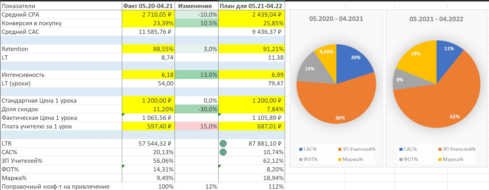</a>
<a href="https://github.com/VasilyDataNinja/portfolio/blob/main/projects/project1/p1.2.jpg">
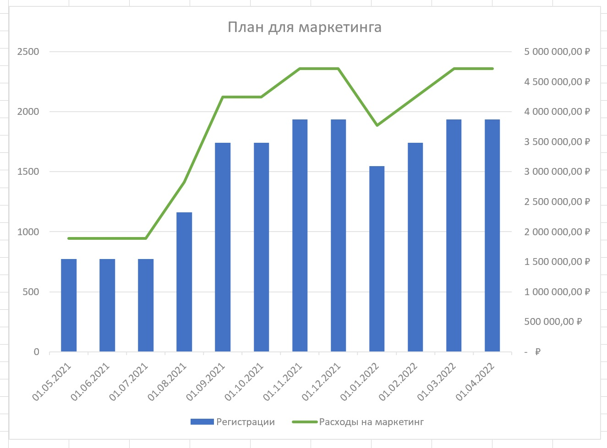
</a>

<!-- Проект 2 -->
<h3 align="center"> Калькулятор юнит-экономики онлайн-кинотеатра </h3>  

Задачи:

<ul>
<li>Просчитать юнит-экономику продукта </li>
<li>Предложить сценарий по настройке параметров для выхода на 25-ти процентную маржинальность</li>
<li>Исследовать данные о пользователях и их поведении </li>
<li>Собрать визуализации основных бизнес-показателей </li>  
</ul>

<a href="https://github.com/VasilyDataNinja/portfolio/blob/main/projects/project2/p2.xlsx">Excel файс с калькулятором
</a>

<a href="https://github.com/VasilyDataNinja/portfolio/blob/main/projects/project2/p2.1.jpg">
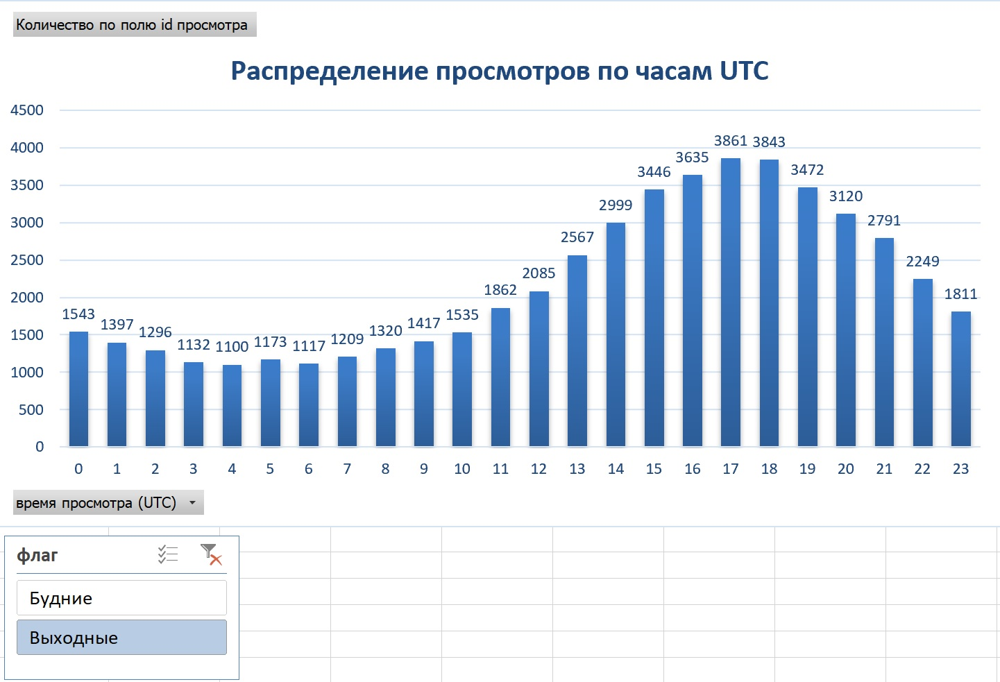</a>
<a href="https://github.com/VasilyDataNinja/portfolio/blob/main/projects/project2/p2.2.jpg">
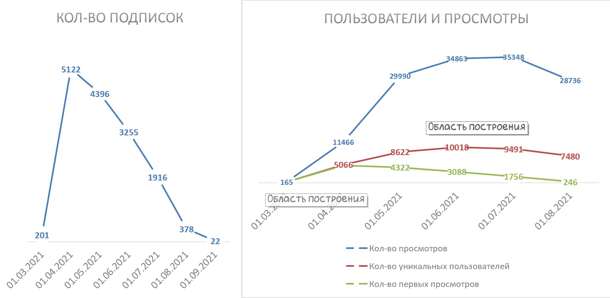
</a>

<!-- Проект 3 -->
<h3 align="center"> Когортный анализ онлайн-кинотеатра с помощью SQL </h3>  

Задачи:

<ul>
<li>Построить распределение количества первых покупок клиента</li>
<li>Построить визуализацию количества покупок в разных срезах</li>
<li>Рассчитать винтажную доходимость по партнёрской программе</li>
</ul>

Код SQL запроса <a href="https://github.com/VasilyDataNinja/portfolio/blob/main/projects/project3/query1.sql">1</a>,<a href="https://github.com/VasilyDataNinja/portfolio/blob/main/projects/project3/query2.sql">2 </a>

<a href="https://github.com/VasilyDataNinja/portfolio/blob/main/projects/project3/p3.xlsx">Excel файс с результатами запроса
</a>

<a href="https://github.com/VasilyDataNinja/portfolio/blob/main/projects/project3/p3.1.jpg">
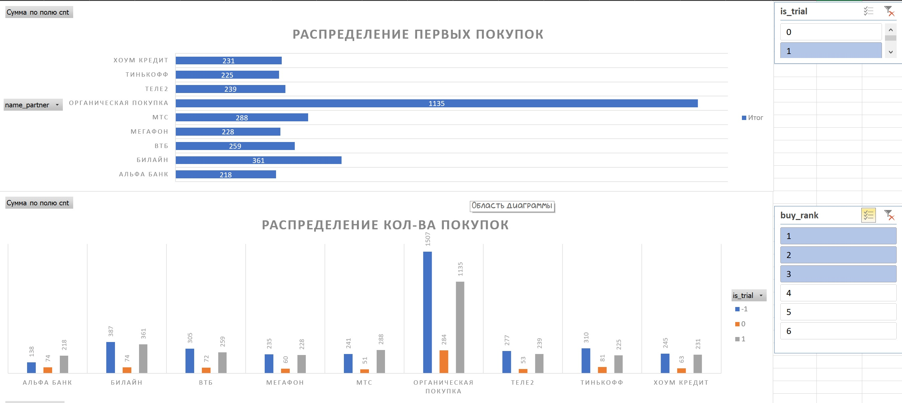</a>
<a href="https://github.com/VasilyDataNinja/portfolio/blob/main/projects/project3/p3.2.jpg">
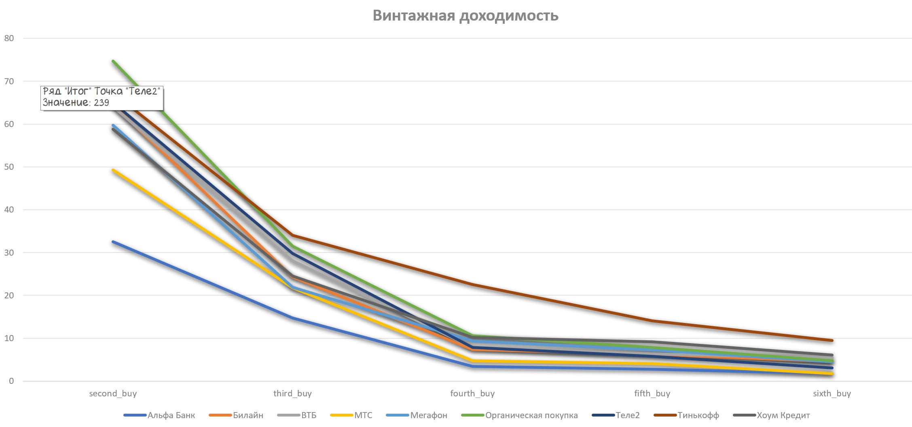
</a>

<!-- Проект 4 -->
<h3 align="center"> Моделирование изменения балансов студентов онлайн школы </h3> 

Задачи:

<ul>
<li>Создать таблицу с балансами всех студентов за каждый календарный день </li>
<li>Создать таблицу с изменением балансов под влиянием транзакций и списаний уроков</li>
<li>Создать таблицу с балансами каждого студента за каждый день</li>
<li>Построить визуализацию итоговых результатов</li>
</ul>

Код SQL запроса <a href="https://github.com/VasilyDataNinja/portfolio/blob/main/projects/project4/query1.sql">1</a>,<a href="https://github.com/VasilyDataNinja/portfolio/blob/main/projects/project4/query2.sql">2 </a>

<a href="https://github.com/VasilyDataNinja/portfolio/blob/main/projects/project4/p4.xlsx">Excel файс с результатами запроса
</a>

<a href="https://github.com/VasilyDataNinja/portfolio/blob/main/projects/project4/p4.1.jpg">
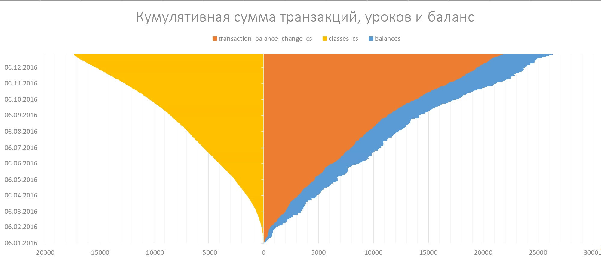</a>
<a href="https://github.com/VasilyDataNinja/portfolio/blob/main/projects/project4/p4.2.jpg">
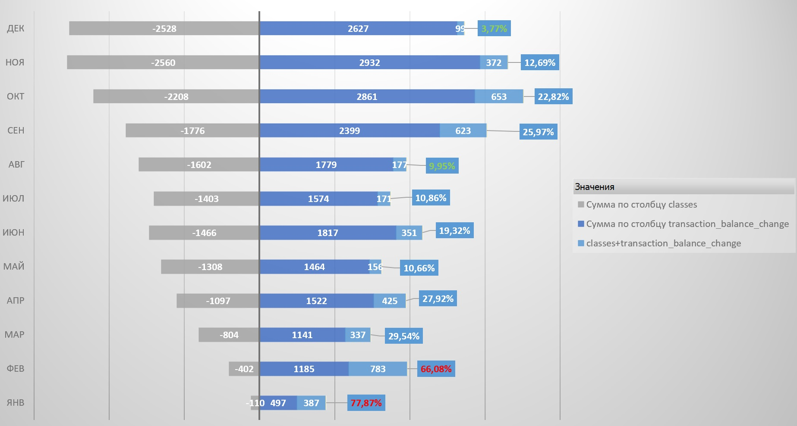
<a href="https://github.com/VasilyDataNinja/portfolio/blob/main/projects/project4/p4.3.jpg">
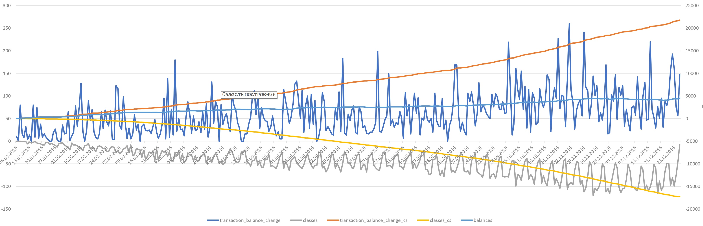
</a>

<!-- Проект 5 -->
<h3 align="center"> Проверка гипотез в онлайн школе </h3> 

Гипотезы:

<ul>
<li>Короткие уроки чаще закупаются "оптом"</li>
<li>У учеников-старожилов бóльшую часть занятий ведут продвинутые учителя</li>
<li>Снижение объема поступающих средств в связи со снижением количества проводимых уроков и общего количества учащихся студентов</li>
</ul>

Код SQL запроса <a href="https://github.com/VasilyDataNinja/portfolio/blob/main/projects/project5/query1.sql">1</a>,<a href="https://github.com/VasilyDataNinja/portfolio/blob/main/projects/project5/query2.sql">2</a>,<a href="https://github.com/VasilyDataNinja/portfolio/blob/main/projects/project5/query3.sql">3</a>

<a href="https://github.com/VasilyDataNinja/portfolio/blob/main/projects/project5/p5.1.jpg">
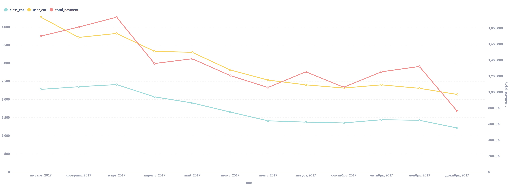
</a>

<!-- Проект 6 -->
<h3 align="center"> Анализ "аэропортовых очередей" в агрегаторе такси </h3> 

Задачи:

<ul>
<li>Произвести расчёт количества выездов с заказом и без на определённом сегменте водителей</li>
<li>Рассчитать среднее время ожидания заказа и долю успешных поездок</li>
<li>Ко скольки лучше приезжать в Домодедово, чтобы уехать как можно быстрее и с наибольшей вероятностью получить заказ?</li>
</ul>

Код SQL запроса <a href="https://github.com/VasilyDataNinja/portfolio/blob/main/projects/project6/query1.sql">1</a>,<a href="https://github.com/VasilyDataNinja/portfolio/blob/main/projects/project6/query2.sql">2</a>,<a href="https://github.com/VasilyDataNinja/portfolio/blob/main/projects/project6/query3.sql">3</a>

<a href="https://github.com/VasilyDataNinja/portfolio/blob/main/projects/project6/p6.xlsx">Excel файс с результатами запроса
</a>

<a href="https://github.com/VasilyDataNinja/portfolio/blob/main/projects/project6/6.1.jpg">
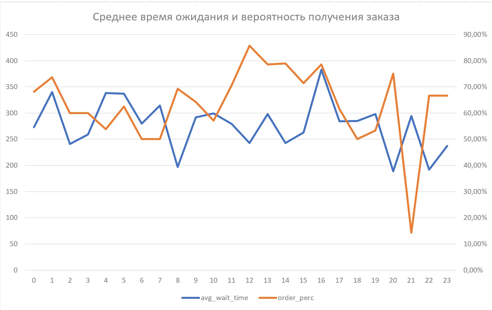
</a>

<!-- Контакты -->
<h2 align="center">Контактная информация</h2>

